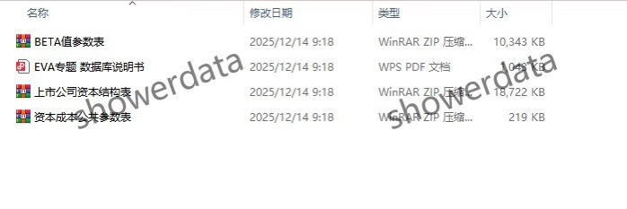
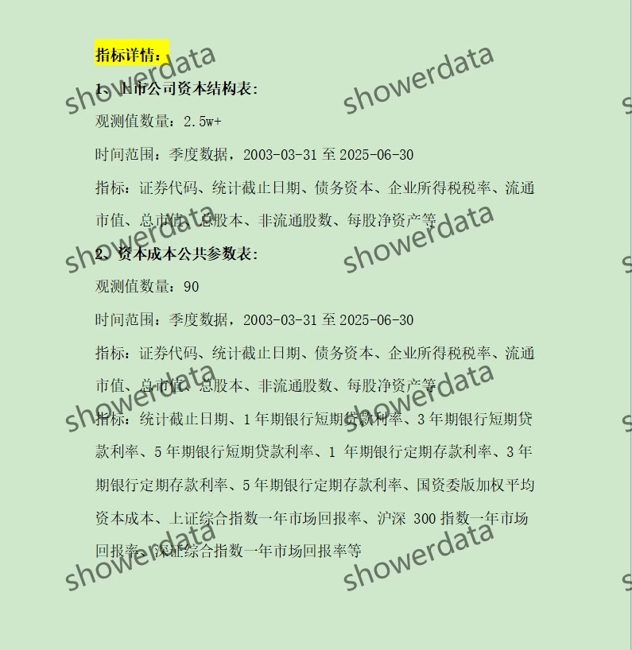
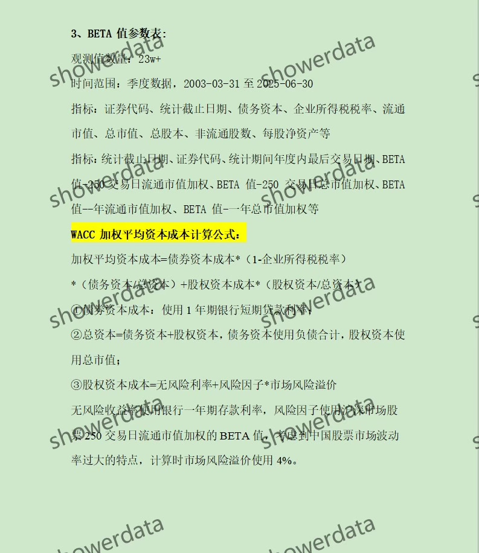
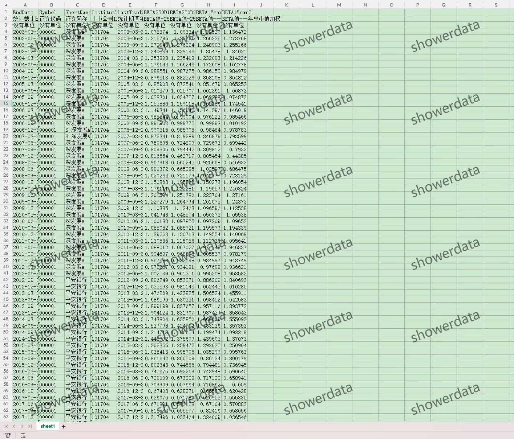
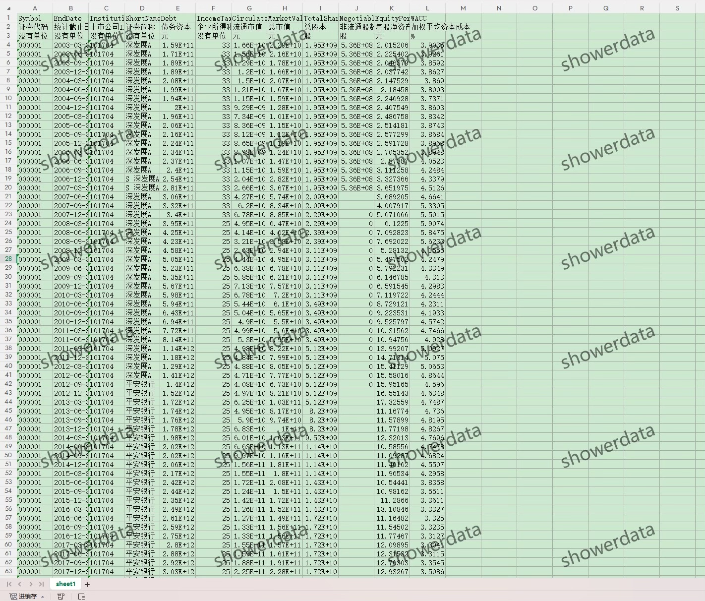
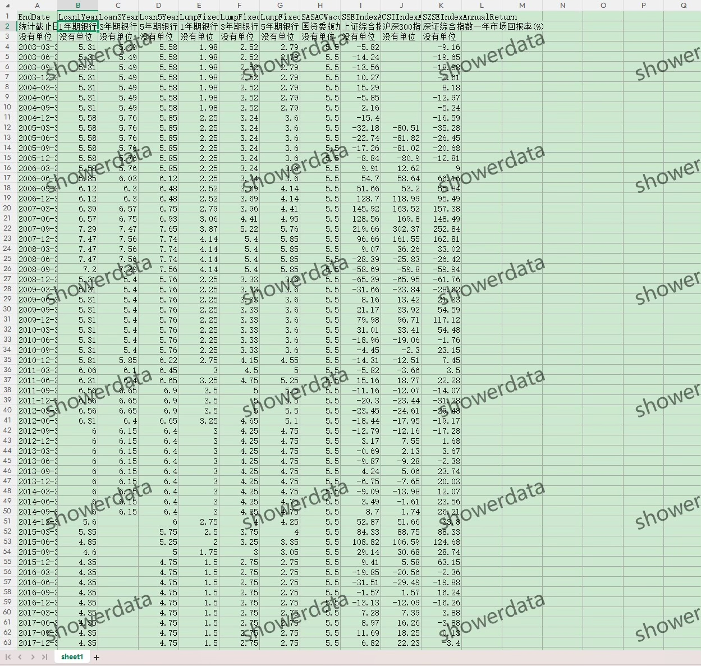

## Body

# 上市公司-加权平均资本成本（WACC）

## 一、数据介绍

### 数据名称：上市公司-加权平均资本成本（WACC）

### 样本范围：A鼓尚视公司

### 时间范围：2003-03-31至 2025-06-30，季度数据

### 数据格式：压缩包，里面是excel，需要先保存，再下载，再解压

### 数据内容：原始数据Excel、字段说明txt（最终指标WACC计算结果在资本结构表里）、说明书

## 二、数据结果指标如图所示

## 三、计算方法如图所示

## 四、参考文献如图所示

## Images

item_1002418974797

Here is a pay link on Stripe ( https://buy.stripe.com/3cs8yP7sY87d0vu9AB ). Please contact me lonlonago@foxmail.com after funding $89, and I will send you a complete data files , thank you!

